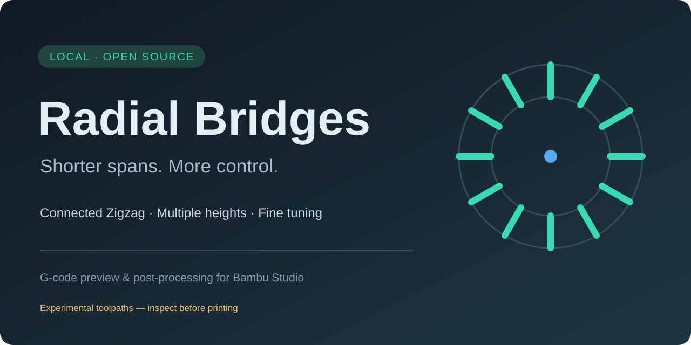
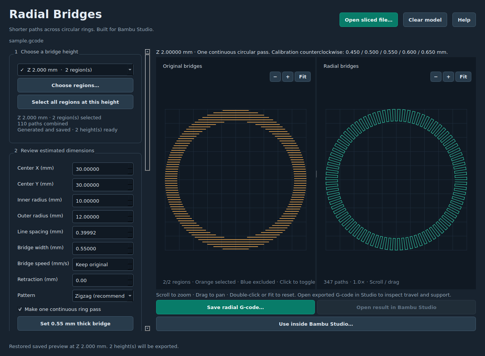
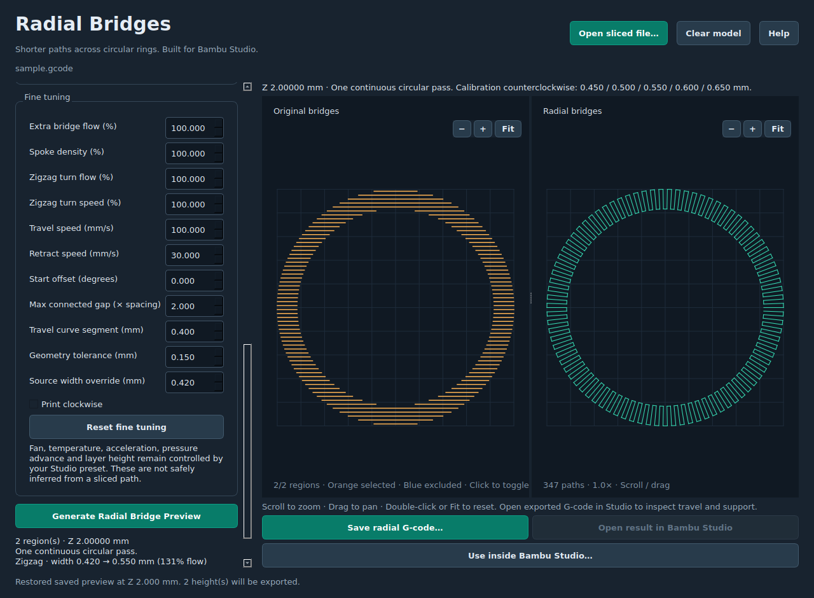
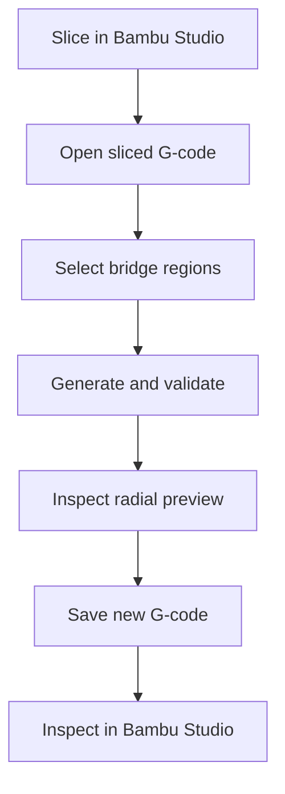

<div align="center">
  
  <br><br>

  **Turn long circular bridge paths into short radial spans, then inspect every change before printing.**

  [](../../releases/latest)
  [](../../releases/latest)
  [](LICENSE)
  [](#privacy)

  [Download](../../releases/latest) · [How it works](#how-it-works) · [Fine tuning](#fine-tuning) · [Build](docs/BUILD.md) · [Report a problem](../../issues/new)
</div>

---

Radial Bridges is a free, open-source Windows tool for Bambu Studio G-code. It finds eligible circular bridge rings and replaces their long paths with shorter radial spokes. You can select bridge areas, tune each physical height separately, compare the original and generated paths, and reopen the result in Bambu Studio for final inspection.

The installer includes its own Python and Qt runtime. You do not need to install Python or edit configuration files by hand.

> [!CAUTION]
> Radial Bridges changes printer movement and extrusion commands. Inspect the exported G-code in Bambu Studio and confirm that both ends of every bridge land on supported material before printing.

## Preview before you print

<table>
  <tr>
    <td width="50%"></td>
    <td width="50%"></td>
  </tr>
  <tr>
    <td align="center"><strong>Original and generated paths</strong><br>Click regions, zoom, pan, and verify the result.</td>
    <td align="center"><strong>Detailed bridge controls</strong><br>Tune flow, density, turns, travel, spacing, and direction.</td>
  </tr>
</table>

## Why Radial Bridges?

Conventional slicing can send a bridge across the long dimension of a circular opening. Radial Bridges aims each line across the narrow ring width instead. The result can reduce unsupported span length while keeping the rest of the sliced model unchanged.

| Capability | What it gives you |
|---|---|
| Radial conversion | Short paths between the inner and outer ring boundaries |
| Connected Zigzag | Neighboring spokes joined by short extruded turns instead of repeated retractions |
| Monotonic patterns | Consistent inward or outward bridge directions |
| Interactive selection | Click same-height bridge regions; orange is included and blue is excluded |
| Multiple bridge heights | Preserve separate settings and previews for different Z heights |
| Thin-layer tuning | Independent bridge width, flow, density, speed, and spacing controls |
| Calibration sectors | Compare 3–9 widths in one circular test |
| Safe refusal | Unsupported geometry or commands stop with a selectable error message |
| Bambu Studio workflow | Save a new G-code or install a geometry-matched post-processing command |
| Local processing | No uploads, telemetry, accounts, or printer connection |

## Get started

1. Open [Releases](../../releases/latest) and download the latest `RadialBridges-Setup-...exe` and `SHA256SUMS.txt`.
2. Compare the installer's SHA-256 with the published checksum.
3. Install Radial Bridges for your Windows account.
4. In Bambu Studio, slice your plate and export plain `.gcode` or a sliced `.gcode.3mf`.
5. Open the exported file in Radial Bridges.
6. Select a bridge height and click the bridge regions you want to convert.
7. Choose a pattern and click **Generate Radial Bridge Preview**.
8. Repeat for any other bridge heights. A checkmark identifies every completed height.
9. Save a new G-code and click **Open result in Bambu Studio**.
10. Inspect extrusion, travel, layer height, and support before printing.

The original file remains unchanged during manual conversion.

## How it works



Radial Bridges reads labeled bridge features from the sliced G-code. It estimates the center, inner radius, outer radius, source line width, and spacing. Before replacing anything, it verifies that the selected extrusion resembles a complete narrow ring and refuses geometry outside its supported scope.

### Use it inside Bambu Studio

After generating previews, click **Use inside Bambu Studio** and copy the supplied command into:

**Process → Others → Post-processing scripts**

The generated profile matches the selected geometry. Create a new profile after resizing, moving, or substantially re-slicing the model. The post-processing hook keeps a backup of the original G-code.

## Patterns

| Pattern | Behavior | Good starting use |
|---|---|---|
| Connected Zigzag | Alternates inward and outward, joining neighboring spokes | Fewer retractions and one flowing pass |
| Monotonic outward | Every spoke prints from the inner edge to the outer edge | Consistent strand direction |
| Monotonic inward | Every spoke prints from the outer edge to the inner edge | Reverse monotonic direction |

## Fine tuning

<details>
<summary><strong>Open the fine-tuning reference</strong></summary>

| Control | Effect |
|---|---|
| Bridge width | Target width and width-based extrusion scaling |
| Extra bridge flow | Additional extrusion multiplier independent of width |
| Spoke density | Number of generated radial lines |
| Zigzag turn flow and speed | Connected-turn behavior without changing the spokes |
| Bridge speed | Maximum generated extrusion speed; can retain the slower sliced speed |
| Travel and retraction | Generated non-printing motion only |
| Start offset and clockwise | Radial layout and printing order |
| Maximum connected gap | When Zigzag connects with extrusion versus travel |
| Travel curve segment | Smoothness of travel around the ring |
| Geometry tolerance | Expert validation tolerance; it does not create support |
| Source-width override | Width used as the extrusion-scaling reference |

Hover over any input in the application for a description. Fan, temperature, acceleration, pressure advance, nozzle size, and layer height remain controlled by the Bambu Studio preset.

</details>

## Supported files and geometry

Supported input:

- Plain-text `.gcode` exported after slicing
- Sliced `.gcode.3mf` plates containing Bambu feature comments
- Multiple independent physical bridge heights
- Split same-height ring fragments when the safety checks permit combining them

Current geometry scope:

- Complete narrow annular bridge areas
- Known and constant physical Z height
- Outer-radius to inner-radius ratio no greater than 1.5
- Supported command and motion forms explicitly recognized by the converter

Radial Bridges is currently focused on circular rings. It is not a complete slicer, arbitrary infill editor, support generator, or print simulator.

## Calibration workflow

1. Start with the bridge width and spacing from your sliced profile.
2. Enable **Calibration sweep around ring**.
3. Choose 3–9 sectors and a width range.
4. Print a small representative test using the same nozzle, material, temperature, and cooling.
5. Identify the strongest and cleanest sector.
6. Enter that width, disable calibration, and generate the final preview.

Lower bridge flow, appropriate speed, and strong cooling can matter as much as width. Treat presets as starting values and test the actual material and printer.

## Privacy

Everything runs on your computer. Radial Bridges does not upload models or G-code, collect telemetry, require an account, or connect to your printer.

Application data and post-processing backups are stored under your Windows LocalAppData `Radial Bridges` folder.

## Build and test

```bash
python -m pip install -r requirements-dev.txt
python -m unittest discover -s payload -v
python gui_smoke.py
python payload/app.py
```

See the [Windows build guide](docs/BUILD.md), [code review notes](docs/CODE_REVIEW.md), [release checklist](docs/RELEASE.md), and [signing guide](docs/SIGNING.md).

## Contributing

Bug reports and representative sliced files are especially useful. Remove private filenames or model information before sharing a file publicly.

- Read [CONTRIBUTING.md](CONTRIBUTING.md) before submitting code.
- Use [GitHub Issues](../../issues) for reproducible bugs and feature proposals.
- Review [SECURITY.md](SECURITY.md) for private vulnerability reporting.

## License and project status

Radial Bridges is released under the [MIT License](LICENSE). Bundled Python, Qt, PySide6, and Shiboken components retain their own licenses; see [third-party notices](payload/THIRD-PARTY-NOTICES.txt).

The current Windows installer is unsigned until the project has a trusted Authenticode signing identity. Windows may display a SmartScreen warning. Checksums verify file integrity but do not identify the publisher.

Independent project; not affiliated with or endorsed by Bambu Lab. Bambu Studio is a trademark of its respective owner.

<div align="center">
  
  <br>
  <strong>Shorter spans. More control.</strong>
</div>
